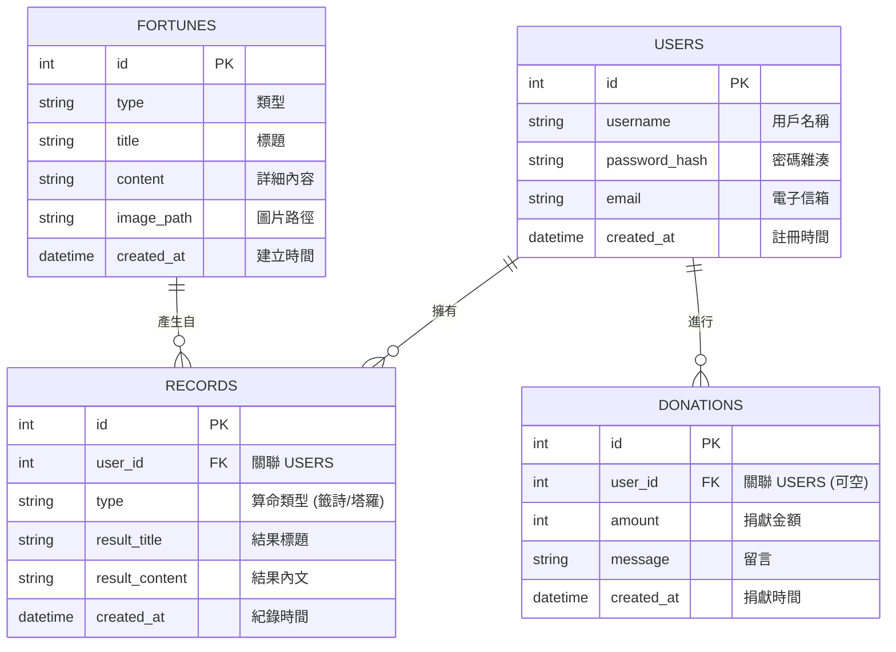

# 資料庫設計文件：線上算命系統

本文件定義了線上算命系統的資料庫結構、欄位說明與實體關係圖 (ER Diagram)。系統採用 **SQLite** 作為資料庫引擎。

## 1. ER 圖 (實體關係圖)

## 2. 資料表詳細說明

### 2.1 USERS (使用者表)
儲存會員的基本帳號資訊。

| 欄位名 | 型別 | 必填 | 說明 |
| :--- | :--- | :--- | :--- |
| id | INTEGER | 是 | Primary Key, 自動遞增 |
| username | TEXT | 是 | 唯一帳號名稱 |
| password_hash | TEXT | 是 | 加密後的密碼 |
| email | TEXT | 否 | 使用者信箱 |
| created_at | DATETIME | 是 | 預設為目前時間 |

### 2.2 FORTUNES (籤詩/結果池)
儲存靜態的籤詩、占卜結果內容。

| 欄位名 | 型別 | 必填 | 說明 |
| :--- | :--- | :--- | :--- |
| id | INTEGER | 是 | Primary Key, 自動遞增 |
| type | TEXT | 是 | 例如：'籤詩', '塔羅' |
| title | TEXT | 是 | 例如：'第一籤 大吉' |
| content | TEXT | 是 | 完整解籤內容 |
| image_path | TEXT | 否 | 對應的視覺圖片路徑 |
| created_at | DATETIME | 是 | 預設為目前時間 |

### 2.3 RECORDS (算命紀錄表)
紀錄使用者過去的算命結果。

| 欄位名 | 型別 | 必填 | 說明 |
| :--- | :--- | :--- | :--- |
| id | INTEGER | 是 | Primary Key, 自動遞增 |
| user_id | INTEGER | 是 | Foreign Key -> USERS.id |
| type | TEXT | 是 | 算命類型 |
| result_title | TEXT | 是 | 當時獲得的結果標題 |
| result_content | TEXT | 是 | 當時獲得的結果內文 |
| created_at | DATETIME | 是 | 預設為目前時間 |

### 2.4 DONATIONS (香油錢紀錄表)
紀錄捐獻資訊。

| 欄位名 | 型別 | 必填 | 說明 |
| :--- | :--- | :--- | :--- |
| id | INTEGER | 是 | Primary Key, 自動遞增 |
| user_id | INTEGER | 否 | Foreign Key -> USERS.id (匿名捐款則為空) |
| amount | INTEGER | 是 | 捐獻金額 |
| message | TEXT | 否 | 祈福留言 |
| created_at | DATETIME | 是 | 預設為目前時間 |
