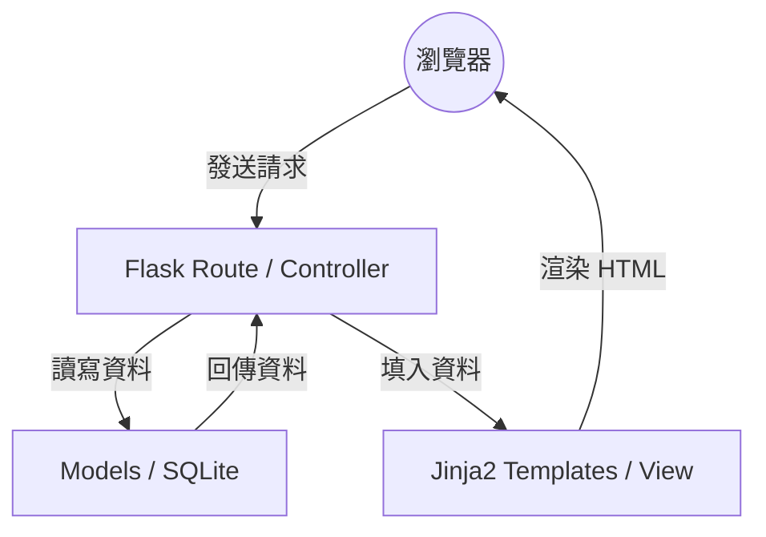

# 線上占卜系統 — 系統架構設計 (Architecture Design)

> **版本：** v1.0
> **建立日期：** 2026-04-09
> **專案名稱：** 線上占卜系統
> **技術棧：** Flask + Jinja2 + SQLite

---

## 1. 技術架構說明

本專案採用典型的 **單體式架構 (Monolithic Architecture)**，並遵循 **MVC (Model-View-Controller)** 設計模式。這種架構適合快速開發與部署，且能滿足本專案對於高品質視覺效果與伺服器端渲染的需求。

### 選用技術與原因
- **後端 (Python + Flask)**: 輕量級框架，擴充性強，適合中小型 Web 專案。
- **模板引擎 (Jinja2)**: Flask 內建，能高效地將後端資料注入 HTML，實現動態頁面。
- **資料庫 (SQLite)**: 無需額外安裝資料庫伺服器，將資料儲存在單一檔案中，方便開發與分發。
- **前端 (HTML + Vanilla CSS)**: 不使用重型框架，專注於利用 CSS 動畫打造極致的占卜體驗。

### MVC 模式職責分配
- **Model (模型)**: 負責與 SQLite 資料庫互動，定義資料結構（如：使用者、占卜紀錄、籤詩庫）。
- **View (視圖)**: 使用 Jinja2 模板產出 HTML，負責將資料呈現給使用者。
- **Controller (控制器)**: 即 Flask 的路由 (Routes)，負責處理 HTTP 請求、呼叫 Model 取得資料，並決定渲染哪個 View。

---

## 2. 專案資料夾結構

```text
web_app_development/
├── app/
│   ├── __init__.py      # Flask App 初始化
│   ├── models/          # 資料庫模型 (Model)
│   │   ├── user.py      # 使用者相關資料處理
│   │   └── fortune.py   # 占卜、籤詩、紀錄相關處理
│   ├── routes/          # 路由處理 (Controller)
│   │   ├── auth.py      # 註冊、登入邏輯
│   │   └── main.py      # 占卜、首頁、捐款邏輯
│   ├── templates/       # HTML 模板 (View)
│   │   ├── base.html    # 共同佈局
│   │   ├── index.html   # 首頁
│   │   ├── login.html   # 登入頁
│   │   └── fortune.html # 抽籤/結果頁
│   └── static/          # 靜態資源
│       ├── css/         # 樣式表 (含動畫定義)
│       └── js/          # 前端互動邏輯 (如觸發動畫)
├── instance/
│   └── database.db      # SQLite 資料庫檔案
├── database/
│   └── schema.sql       # 資料庫建表語法
├── docs/                # 專案文件
│   ├── PRD.md
│   └── ARCHITECTURE.md
├── app.py               # 應用程式啟動入口
├── README.md
└── requirements.txt     # 套件依賴清單
```

---

## 3. 元件關係圖

### 資料流向圖 (Mermaid 語法)



### 系統交互說明
1. **使用者操作**：點擊「抽籤」按鈕。
2. **路由處理**：`app/routes/main.py` 接收到請求，呼叫 `fortune.py` 裡的邏輯隨機選出一支籤。
3. **資料處理**：Model 將結果存入 `instance/database.db` 的紀錄表中。
4. **渲染頁面**：路由將選中的籤詩內容傳給 `app/templates/fortune.html`。
5. **視覺回饋**：瀏覽器載入頁面，執行 `app/static/css/` 中的動畫效果。

---

## 4. 關鍵設計決策

1. **伺服器端渲染 (SSR)**: 選擇 Flask + Jinja2 而非前後端分離，是為了簡化開發流程，並確保 SEO 與首頁載入效率。
2. **SQLite 本地化儲存**: 考量到本專案為練習與 MVP 性質，SQLite 提供的零配置特性是最佳選擇。
3. **動畫優先的靜態資源管理**: 將動畫邏輯集中在 CSS 中，利用 Flask 的 `url_for` 管理靜態資源，確保動畫執行時的資源載入路徑正確。
4. **藍圖化路由管理 (Blueprints)**: 雖然規模不大，但仍採用 `auth` 與 `main` 分離的路由設計，以便後續擴充功能時結構依然清晰。
5. **嚴格的雜湊加密**: 使用 `werkzeug.security` 處理密碼雜湊，確保使用者個資在 SQLite 檔案中是安全的。
