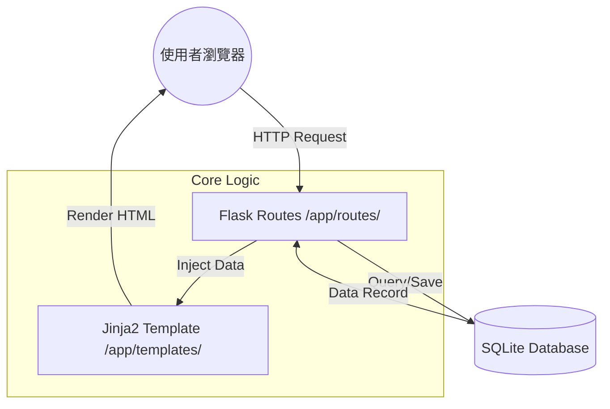

# 線上占卜系統 — 系統架構設計 (Architecture)

> **版本：** v1.0
> **建立日期：** 2026-04-09
> **專案名稱：** 線上占卜系統
> **技術棧：** Flask + Jinja2 + SQLite

---

## 1. 技術架構說明

本系統採用 **Flask MVC (Model-View-Controller)** 模式進行開發。這是一種經典的設計模式，旨在將資料處理、使用者介面與業務邏輯分離，提高程式碼的可維護性。

### MVC 職責分配：
- **Model (模型 - `app/models/`)**：負責與 SQLite 資料庫溝通。定義資料表的結構（Schema）以及資料增刪查改的邏輯。
- **View (視圖 - `app/templates/`)**：使用 Jinja2 模板引擎。負責將資料動態地渲染成 HTML 頁面呈現給使用者。
- **Controller (控制器 - `app/routes/`)**：負責接收使用者的請求、呼叫 Model 取得資料、處理邏輯後將結果丟給 View 渲染。

---

## 2. 專案資料夾結構

為了保持專案整潔且符合 Flask 的最佳實踐，我們規劃如下結構：

```text
web_app_development/
├── app/                      # 核心應用程式程式碼
│   ├── models/               # 資料庫模型 (ORM 或 SQL 封裝)
│   │   ├── __init__.py
│   │   ├── user.py           # 會員相關資料
│   │   └── fortune.py        # 占卜紀錄與籤詩資料
│   ├── routes/               # 路由與邏輯 (Controller)
│   │   ├── __init__.py
│   │   ├── main.py           # 首頁、占卜入口
│   │   ├── auth.py           # 註冊、登入邏輯
│   │   └── actions.py        # 抽籤、捐款等具體行為
│   ├── static/               # 靜態資源
│   │   ├── css/              # 樣式表 (Vanilla CSS)
│   │   ├── js/               # 前端互動邏輯 (動畫控制)
│   │   └── img/              # 圖片與圖示
│   ├── templates/            # Jinja2 HTML 模板 (View)
│   │   ├── base.html         # 基礎佈局 (側邊欄、導覽列)
│   │   ├── index.html        # 首頁
│   │   ├── fortune/          # 占卜相關頁面 (抽籤、算命)
│   │   └── auth/             # 認證相關頁面 (登入、註冊)
│   └── __init__.py           # Flask App Factory
├── instance/                 # 存放不應被 Git 追蹤的安全資料
│   └── database.db           # SQLite 資料庫檔案
├── docs/                     # 專案文件 (PRD, Architecture 等)
├── requirements.txt          # 套件依賴清單
├── .env                      # 環境變數 (如 Secret Key)
└── app.py                    # 專案啟動入口
```

---

## 3. 元件關係圖

以下展示了使用者從瀏覽器發出請求到系統回應的資料流向：



---

## 4. 關鍵設計決策

### 4.1 採用 Vanilla CSS + 精美動效
**決策**：不使用 Tailwind 或 Bootstrap，改用原生 CSS 配套高品質動畫。
**原因**：占卜系統需要強烈的視覺沉浸感（例如搖籤筒、翻牌），原生 CSS 配合 Web Animations API 能提供最細膩的自訂效果。

### 4.2 基於 SQLite 的快速開發
**決策**：初期使用 SQLite 作為資料庫。
**原因**：系統主要為個人或小型社群使用，SQLite 無需額外組態，且方便整個專案資料夾的移動與交付。

### 4.3 靜態解籤資料庫
**決策**：將籤詩內容存放在資料庫中，而不是寫死在程式碼。
**原因**：方便未來擴增更多的籤詩（如不同的廟宇籤種），且能讓後端邏輯更簡潔。

### 4.4 緩存與效能
**決策**：首頁每日運勢將根據「日期 + 使用者 ID」計算，不重複呼叫複雜 API。
**原因**：確保使用者在當天內看到的運勢一致，且減輕資料庫運算負擔。

---

## 5. 安全性考量

1. **密碼安全**：使用 `werkzeug.security` 進行密碼雜湊，資料庫絕不存放明文密碼。
2. **CSRF 保護**：所有表單提交均包含 CSRF Token。
3. **路徑保護**：佔卜紀錄與功德箱紀錄僅限登入使用者可存取。
