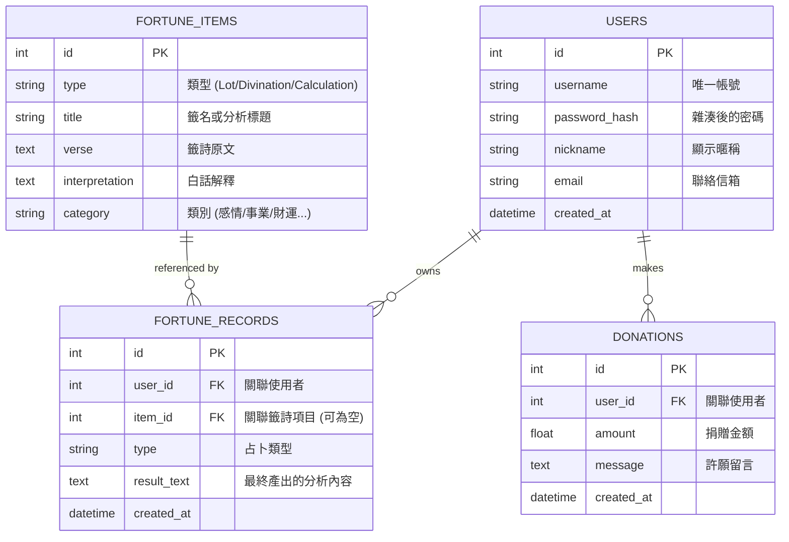

# 線上占卜系統 — 資料庫設計 (Database Design)

> **版本：** v1.0
> **建立日期：** 2026-04-09
> **專案名稱：** 線上占卜系統
> **資料庫類型：** SQLite

---

## 1. ER 圖 (Entity Relationship Diagram)

---

## 2. 資料表詳細說明

### 2.1 `users` 表
儲存使用者的認證資訊與個人設定。

| 欄位名 | 型別 | 說明 | 限制 |
| :--- | :--- | :--- | :--- |
| id | INTEGER | 自動增量主鍵 | PK, AUTOINCREMENT |
| username | VARCHAR(50) | 登入帳號 | UNIQUE, NOT NULL |
| password_hash | VARCHAR(255) | 雜湊密碼 | NOT NULL |
| nickname | VARCHAR(50) | 顯示名稱 | NOT NULL |
| email | VARCHAR(100) | 電子信箱 | |
| created_at | DATETIME | 註冊時間 | DEFAULT CURRENT_TIMESTAMP |

### 2.2 `fortune_items` 表
儲存靜態的籤詩、占卜結果庫。

| 欄位名 | 型別 | 說明 | 限制 |
| :--- | :--- | :--- | :--- |
| id | INTEGER | 自動增量主鍵 | PK, AUTOINCREMENT |
| type | VARCHAR(20) | 分類 (Lot, Divination, etc.) | NOT NULL |
| title | VARCHAR(100) | 籤詩標題 (例如: 第一籤) | NOT NULL |
| verse | TEXT | 籤詩內容 | NOT NULL |
| interpretation | TEXT | 白話解籤 | NOT NULL |
| category | VARCHAR(20) | 建議類別 | |

### 2.3 `fortune_records` 表
記錄使用者的每一次占卜結果。

| 欄位名 | 型別 | 說明 | 限制 |
| :--- | :--- | :--- | :--- |
| id | INTEGER | 自動增量主鍵 | PK, AUTOINCREMENT |
| user_id | INTEGER | 使用者 ID | FK, NOT NULL |
| item_id | INTEGER | 關聯籤詩 ID (若有) | FK, NULLABLE |
| type | VARCHAR(20) | 占卜類型 | NOT NULL |
| result_text | TEXT | 該次產生的分析結果 | NOT NULL |
| created_at | DATETIME | 占卜時間 | DEFAULT CURRENT_TIMESTAMP |

### 2.4 `donations` 表
記錄使用者的香油錢捐獻歷史。

| 欄位名 | 型別 | 說明 | 限制 |
| :--- | :--- | :--- | :--- |
| id | INTEGER | 自動增量主鍵 | PK, AUTOINCREMENT |
| user_id | INTEGER | 使用者 ID | FK, NOT NULL |
| amount | FLOAT | 捐贈數額 | NOT NULL |
| message | TEXT | 許願/留言內容 | |
| created_at | DATETIME | 捐贈時間 | DEFAULT CURRENT_TIMESTAMP |

---

## 3. SQL 建表語法

請參考 `database/schema.sql` 檔案中的完整實作。

## 4. 關鍵設計決定
- **資料型別選擇**：日期時間一律採用 `DATETIME` 或 `TIMESTAMP`，SQLite 中會以字串或整數處理。
- **擴充性**：`fortune_items` 允許我們未來輕鬆增加「塔羅牌」、「西洋占星」等不同體系的文本資料。
- **匿名存取**：雖然資料表設計了 `user_id` FK，但核心占卜邏輯應容許未登入使用者使用（此時不存入 `fortune_records`）。
