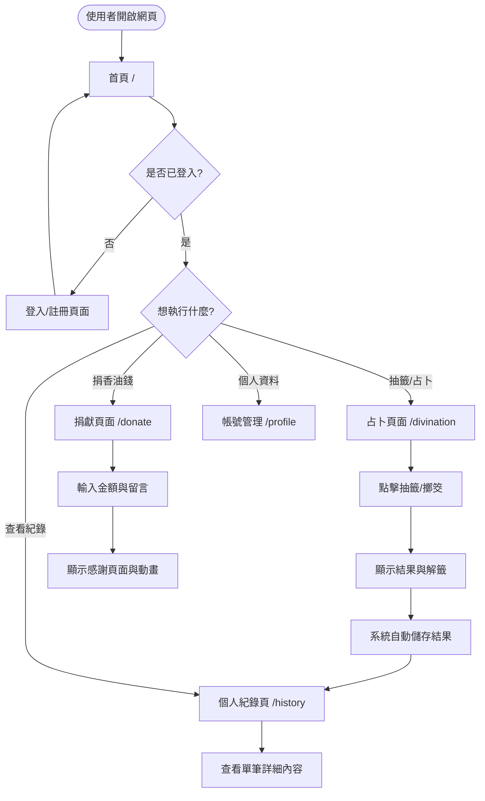
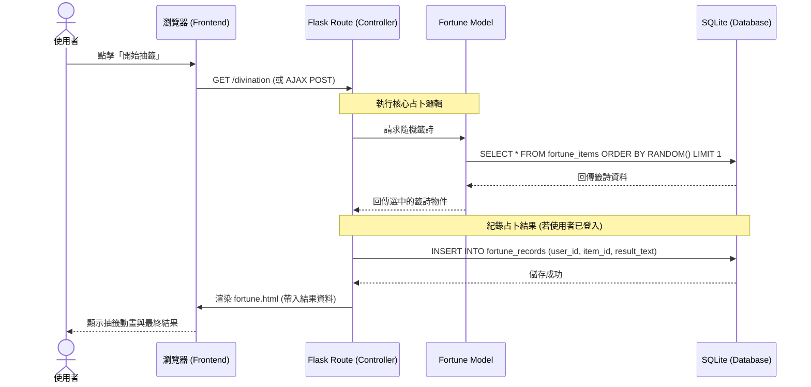

# 線上占卜系統 — 流程圖設計 (Flowchart Design)

> **版本：** v1.0
> **建立日期：** 2026-04-09
> **專案名稱：** 線上占卜系統

---

## 1. 使用者流程圖 (User Flow)

描述使用者從開啟網頁到完成占卜與查看紀錄的過程。

---

## 2. 系統序列圖 (Sequence Diagram) — 以「抽籤」流程為例

描述從前端操作到後端資料處理與資料庫互動的完整生命週期。

---

## 3. 功能清單與路徑對照表

本表用於後續路由開發 (API Design) 之參考。

| 功能模組 | 操作描述 | 建議 URL 路徑 | HTTP 方法 | 對應頁面 |
| :--- | :--- | :--- | :--- | :--- |
| **首頁** | 顯示品牌故事與入口 | `/` | GET | `index.html` |
| **身分認證** | 使用者登入 | `/login` | GET/POST | `login.html` |
| **身分認證** | 使用者註冊 | `/register` | GET/POST | `register.html` |
| **占卜系統** | 選擇占卜類型或抽籤 | `/divination` | GET | `divination.html` |
| **占卜系統** | 顯示占卜/抽籤結果 | `/divination/result` | POST/GET | `fortune.html` |
| **香油錢** | 捐贈虛擬金額與留言 | `/donate` | GET/POST | `donate.html` |
| **紀錄管理**| 列表顯示個人歷史結果 | `/history` | GET | `history.html` |
| **紀錄管理**| 查看單筆紀錄詳情 | `/history/<id>` | GET | `history_detail.html` |
| **帳號管理**| 修改暱稱或登出 | `/profile` | GET/POST | `profile.html` |

---

## 4. 流程說明

1.  **儀式感優化**：在「抽籤」到「顯示結果」之間，系統會透過前端 CSS/JS 觸發一段動畫，增強使用者的儀式感體驗。
2.  **自動儲存邏輯**：系統會判斷 `session` 中是否有使用者 ID，若有則在產出結果的同時自動寫入 `fortune_records` 表。
3.  **封閉式循環**：捐獻香油錢後會引導使用者回到首頁或紀錄頁，強化「捐獻 -> 功德 -> 紀錄」的正向循環感。
