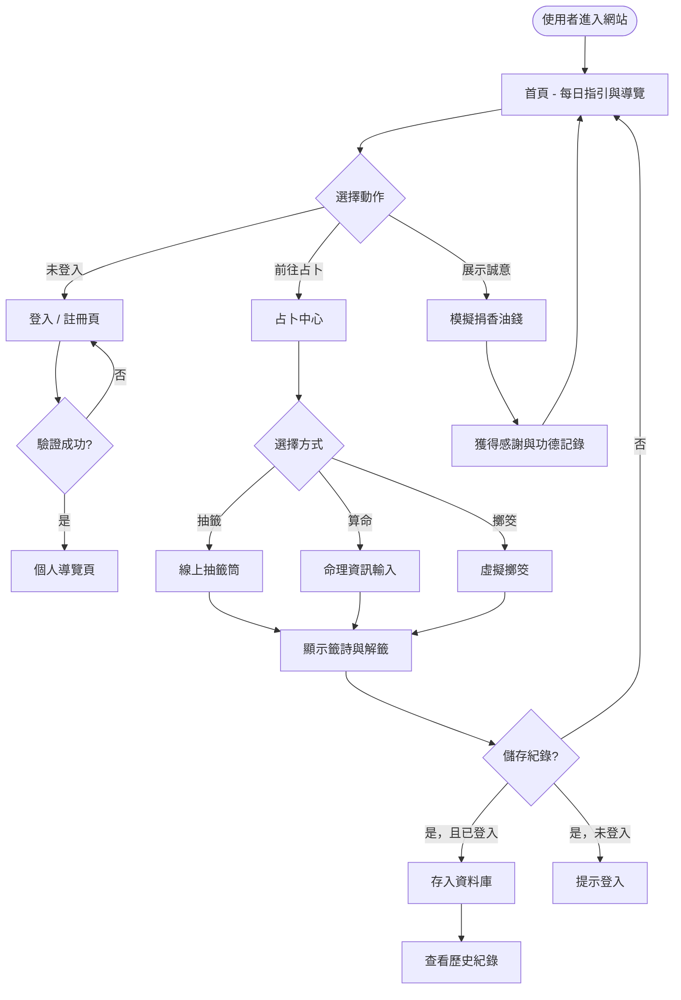
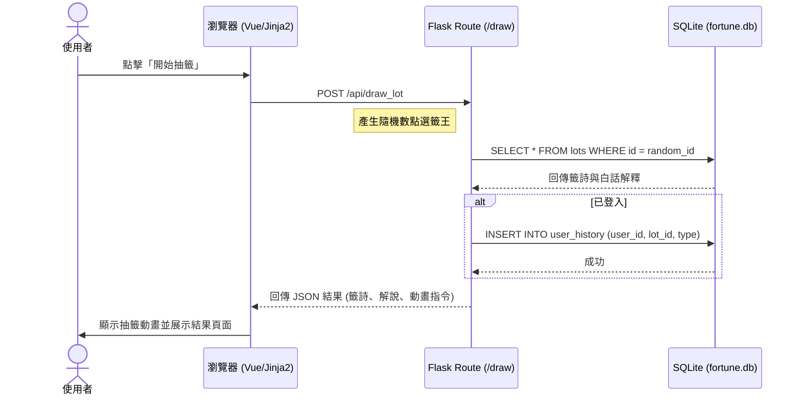

# 線上占卜系統 — 流程圖設計 (Flowchart)

> **版本：** v1.0
> **建立日期：** 2026-04-09
> **專案名稱：** 線上占卜系統

---

## 1. 使用者流程圖 (User Flow)

描述使用者進入系統後的主要操作路徑。

---

## 2. 系統序列圖 (Sequence Diagram)

以「線上抽籤」為例，描述前端到後端資料庫的完整互動流程。

---

## 3. 功能清單與路由對照表

本表列出系統核心功能對應的技術實作路徑。

| 功能名稱 | 說明 | URL 路徑 | 方法 |
| :--- | :--- | :--- | :--- |
| **首頁** | 顯示每日指引與快速入口 | `/` | `GET` |
| **註冊** | 使用者帳號建立 | `/register` | `GET/POST` |
| **登入** | 使用者身份驗證 | `/login` | `GET/POST` |
| **抽籤入口** | 線上抽籤功能頁面 | `/fortune/draw` | `GET/POST` |
| **算命入口** | 八字/姓名算命輸入頁 | `/fortune/calculate` | `GET/POST` |
| **擲筊入口** | 線上擲筊動畫頁面 | `/fortune/toss` | `GET/POST` |
| **歷史紀錄** | 查看個人過去占卜結果 | `/history` | `GET` |
| **模擬捐款** | 捐獻香油錢操作 | `/donate` | `GET/POST` |
| **個人資料** | 修改暱稱與頭像 | `/profile` | `GET/POST` |

---

## 4. 異常處理流程

1. **未登入存取保護頁面**：系統將自動重新導向至 `/login`。
2. **抽籤資料庫異常**：若無法取得籤詩，顯示「神明忙碌中，請稍後再試」提示。
3. **資料輸入錯誤**：算命輸入資訊不完整時，前端進行 JS 攔截並提示。
